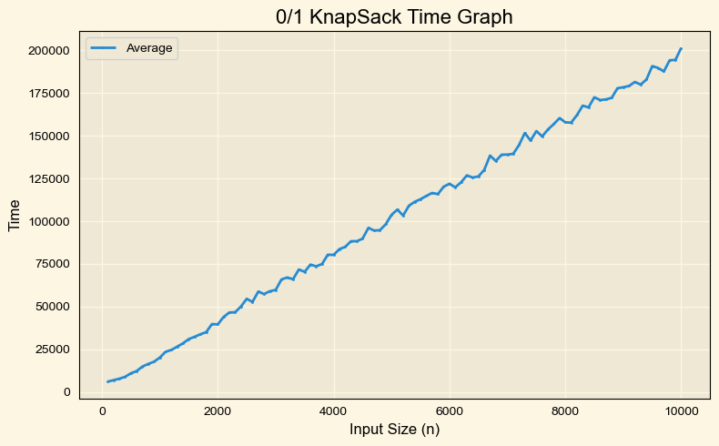

# LAB 9

---

## Program 1: Longest Common Subsequence (LongestCommonSubsequence.java)

### Aim
To find the length of the Longest Common Subsequence (LCS) between two strings using Dynamic Programming.

### Pseudocode

    ALGO LCS(text1, text2)
        n ← length(text1)
        m ← length(text2)
        CREATE memo[n+1][m+1]

        FOR i ← 1 TO n
            FOR j ← 1 TO m
                IF text1[i-1] == text2[j-1]
                    memo[i][j] ← 1 + memo[i-1][j-1]
                ELSE
                    memo[i][j] ← MAX(memo[i-1][j], memo[i][j-1])
                END IF
            END FOR
        END FOR

        RETURN memo[n][m]

### Variables Used
- `text1, text2` — Input strings
- `memo[][]` — DP table storing LCS lengths
- `i, j` — Loop counters

### Algorithm Explanation
The algorithm builds a DP table where each cell represents the LCS of prefixes of two strings.  
If characters match, it extends the subsequence. Otherwise, it takes the maximum of two possibilities.  
The final value gives the length of the LCS, and the sequence can be reconstructed by backtracking.

### Time Complexity
`O(n × m)`

### Space Complexity
`O(n × m)`

---

### Recorded Graph
<!-- INSERT GRAPH IMAGE HERE -->

---

## Program 2: N-Queens Problem (NQueens.java)

### Aim
To place N queens on an N×N chessboard such that no two queens attack each other using Backtracking.

### Pseudocode

    ALGO NQueens(n)
        pos[] ← array of size n
        CALL place(0)

    FUNCTION place(row)
        IF row == n
            RETURN true
        FOR col ← 0 TO n-1
            IF safe(row, col)
                pos[row] ← col
                IF place(row + 1)
                    RETURN true
        RETURN false

### Variables Used
- `n` — Size of chessboard
- `pos[]` — Stores column position of each queen
- `row, col` — Loop counters

### Algorithm Explanation
The algorithm places queens row by row.  
For each position, it checks column and diagonal conflicts.  
If safe, it recursively places the next queen.  
Backtracking occurs when no valid position is found.

### Time Complexity
`O(N!)`

### Space Complexity
`O(N)`

---

### Recorded Graph
<!-- INSERT GRAPH IMAGE HERE -->

---

## Program 3: 0/1 Knapsack (O1KnapSack.java)

### Aim
To maximize profit using the 0/1 Knapsack problem with Dynamic Programming.

### Pseudocode

    ALGO Knapsack(items, capacity)
        CREATE memo[n+1][capacity+1]

        FOR i ← 1 TO n
            FOR w ← 1 TO capacity
                IF weight[i] ≤ w
                    memo[i][w] ← MAX(
                        memo[i-1][w],
                        memo[i-1][w-weight[i]] + profit[i]
                    )
                ELSE
                    memo[i][w] ← memo[i-1][w]
                END IF

        RETURN memo[n][capacity]

### Variables Used
- `profitWeight_matrix[][]` — Stores profit and weight
- `memo[][]` — DP table
- `capacity` — Maximum allowed weight

### Algorithm Explanation
The algorithm builds a DP table where each row represents items and each column represents weight capacity.  
For each item, we decide whether to include or exclude it.  
The optimal solution is stored in the last cell.

### Time Complexity
`O(n × W)`

### Space Complexity
`O(n × W)`

---

### Recorded Graph

---

## Program 4: All-Pairs Shortest Path (PairShortestPath.java)

### Aim
To find shortest paths between all pairs of vertices using the Floyd-Warshall algorithm.

### Pseudocode

    ALGO FloydWarshall(graph)
        dist ← graph

        FOR k ← 0 TO n-1
            FOR i ← 0 TO n-1
                FOR j ← 0 TO n-1
                    dist[i][j] ← MIN(
                        dist[i][j],
                        dist[i][k] + dist[k][j]
                    )

        RETURN dist

### Variables Used
- `adjacency_matrix[][]` — Graph representation
- `current_distance[][]` — Distance matrix
- `i, j, k` — Loop counters

### Algorithm Explanation
The algorithm updates shortest paths by considering each vertex as an intermediate point.  
It checks whether passing through an intermediate vertex improves the path.  
After all iterations, shortest paths between all pairs are obtained.

### Time Complexity
`O(n³)`

### Space Complexity
`O(n²)`

---

### Recorded Graph
<!-- INSERT GRAPH IMAGE HERE -->

---

## Program 5: Traveling Salesperson Problem (TravelingSalesperson.java)

### Aim
To find the minimum cost Hamiltonian cycle using Dynamic Programming (Bitmasking).

### Pseudocode

    ALGO TSP(graph)
        DEFINE memo[mask][i]

        FUNCTION solve(mask, pos)
            IF mask == all_visited
                RETURN graph[pos][0]

            FOR each city not visited
                ans ← MIN(
                    graph[pos][city] + solve(mask | (1<<city), city)
                )

            RETURN ans

### Variables Used
- `adjacency_matrix[][]` — Distance matrix
- `mask` — Bitmask representing visited cities
- `memo[][]` — DP table
- `vertex` — Current city

### Algorithm Explanation
The algorithm uses bitmasking to represent visited cities.  
It recursively explores all possible paths while storing intermediate results.  
Dynamic programming avoids recomputation, making it efficient compared to brute force.

### Time Complexity
`O(n² × 2ⁿ)`

### Space Complexity
`O(n × 2ⁿ)`

---

### Recorded Graph
<!-- INSERT GRAPH IMAGE HERE -->

---